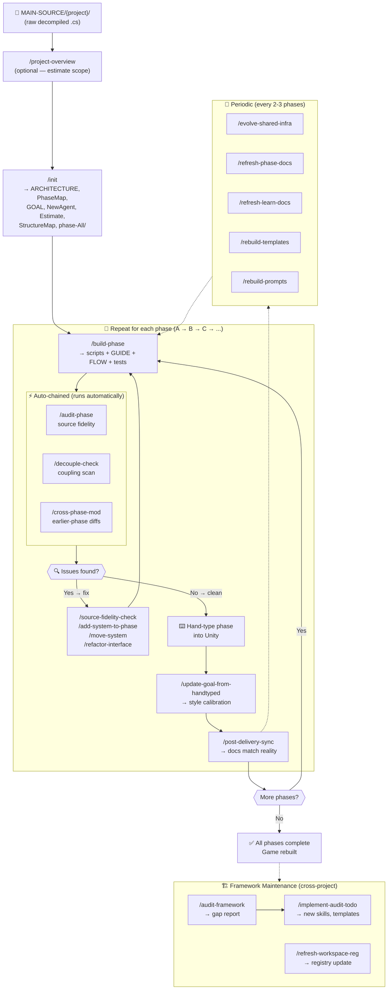

# Copilot Prompts — Usage Guide

> **Who is this for?** Anyone using this workspace for the first time. This guide explains every slash command available, what it does, when to use it, and exactly what to expect when you run it.
>
> **What are slash commands?** They're automated workflows. Type `/` in Copilot Chat, pick a command from the dropdown, and the agent follows the steps defined in a `.prompt.md` file. You don't need to know what's inside the prompt file — just when to use each command.

---

## How to Trigger

In VS Code's Copilot Chat panel, type `/` followed by the command name. A dropdown appears — select it and press Enter. The agent reads the `.prompt.md` file and executes every step automatically.

```
/init                         → bootstrap a new project
/build-phase                  → generate one phase (scripts + docs)
/audit-phase                  → post-delivery self-audit
/source-fidelity-check        → deep source analysis (suggestions only)
/decouple-check               → scan for coupling violations
/cross-phase-mod              → generate earlier-phase diffs
/post-delivery-sync           → sync docs after hand-typing
/update-goal-from-handtyped   → calibrate GOAL.md to your style
/add-system-to-phase          → add a missing system
/refactor-interface            → evolve an interface across phases
/evolve-shared-infra          → analyze phase-All/ health
/refresh-phase-docs           → regenerate Dependency.md + GUIDE.md + FLOW.md
/refresh-learn-docs           → rebuild all top-level LEARN/ docs
/rebuild-templates             → backport proven patterns to templates
/rebuild-prompts               → audit prompts against real code
/audit-framework               → multi-project framework health check
/implement-audit-todo          → apply framework improvements from source
/move-system                  → relocate system between phases
/merge-phase                  → combine underpopulated phases
/refresh-workspace-reg         → rescan MAIN-SOURCE/ & rebuild registry
/project-overview              → quick project analysis (chat only)
```

---

## Quick Reference

| Command | One-Liner | Frequency | When |
|---------|-----------|-----------|------|
| `/init` | Bootstrap all docs from raw source | Once per project | Starting a new game rebuild |
| `/build-phase` | Generate everything for one phase | Once per phase (in order) | Every new phase |
| `/audit-phase` | Method-by-method source fidelity + unlisted discovery | Auto after `/build-phase` + manual reruns | After any delivery or changes |
| `/source-fidelity-check` | Deep source analysis — suggestions only (ask mode) | As needed, re-runnable | Before finalizing, hunting missed features |
| `/decouple-check` | Scan for concrete deps + 80% rule + GameEvents health | Auto after `/build-phase` + after edits | After modifying any system |
| `/cross-phase-mod` | Generate earlier-phase diffs with convention enforcement | Auto after `/build-phase` + before typing | Before hand-typing a new phase |
| `/post-delivery-sync` | Sync all living docs with actual code | Once after hand-typing each phase | After hand-typing, before next phase |
| `/update-goal-from-handtyped` | Calibrate GOAL.md to your actual style | After hand-typing EVERY phase | Your style evolves — run each time |
| `/add-system-to-phase` | Add one system to a completed phase | 0-2 times per project | When a system was missed |
| `/refactor-interface` | Safely evolve an interface across phases | Rare (1-3 per project) | When an interface must change |
| `/evolve-shared-infra` | Audit phase-All/ growth + recommend splits | Every 2-3 phases | When shared code feels bloated |
| `/refresh-phase-docs` | Regenerate all Dependency.md + GUIDE.md + FLOW.md for a phase | After edits, after /decouple-check fixes | Phase docs feel stale or inconsistent |
| `/refresh-learn-docs` | Rebuild all top-level LEARN/ docs from actual code | After multiple phases done, after major refactors | PhaseMap/StructureMap/portability maps outdated |
| `/rebuild-templates` | Extract proven conventions → update templates | After 3+ phases or before new project | Templates feel stale |
| `/rebuild-prompts` | Audit prompt files against real code patterns | After 3+ phases | Prompts produce false positives || `/audit-framework` | Multi-project framework gap analysis | Before adding new genre, after 2+ projects | Framework feels insufficient for new domain |
| `/implement-audit-todo` | Deep-read source → create/update skills, conventions, templates, prompts | After `/audit-framework`, when TODO list exists | Gap report ready, MAIN-SOURCE/ available |
| `/project-overview` | Brief overview — genre, asset counts, build hours by category (chat only) | Before `/init`, anytime | Evaluating a new project, estimating scope |
| `/move-system` | Relocate a system from one phase to another | As needed | System in wrong phase, phase rebalancing, dependency correction |
| `/merge-phase` | Combine two adjacent underpopulated phases | As needed | Phases too small, simplifying structure |
| `/refresh-workspace-reg` | Rescan all projects, recount files, rebuild registry | After new projects added, skills change | WORKSPACE-REG.md feels stale |
---

## Workspace Layout

```
ROOT/
├── .github/
│   ├── copilot-instructions.md       ← always-on context (architecture summary + critical behavior)
│   ├── Manual.md                     ← this file
│   ├── WORKSPACE-REG.md              ← project registry (quick-lookup: scale, genre, skills, status)
│   ├── ROADMAP.md                    ← high-level project roadmap
│   ├── instructions/
│   │   └── csharp-conventions.instructions.md ← C# rules (auto-applied to *.cs)
│   ├── skills/
│   │   ├── unity-testing/SKILL.md         ← vertical slice test patterns, data-first DEBUG_Check
│   │   ├── unity-scene-setup/SKILL.md     ← URP config, lighting profiles, materials, prefab placement
│   │   ├── unity-audio/SKILL.md           ← pool-based SoundManager, SoundDefinitions, FMOD variant
│   │   ├── unity-animation/SKILL.md       ← AnimatorControllers, code-driven rotation, Spine/DOTween variants
│   │   ├── unity-prefab-hierarchy/SKILL.md ← prefab GO structure, universal patterns, genre variants
│   │   ├── unity-save-load/SKILL.md       ← ISaveable, SaveData, SaveManager, JSON, save slots
│   │   ├── unity-fsm/SKILL.md             ← IState, StateMachine, AI/gameplay/UI state machines
│   │   ├── unity-day-night/SKILL.md       ← DayNightCycle, TimePhase, lighting gradients
│   │   ├── unity-ai-navigation/SKILL.md   ← NavMeshAgent + FSM, patrol, A*Pathfinding variant
│   │   ├── unity-networking/SKILL.md      ← FishNet/Photon, client/server tiers, RPC patterns
│   │   ├── unity-quest/SKILL.md           ← SO_QuestDef, WQuest, objective tracking
│   │   ├── unity-procedural-gen/SKILL.md  ← SeededRandom, Perlin terrain, chunk generation
│   │   ├── unity-camera/SKILL.md          ← Cinemachine VCams, manual camera rigs, screen shake
│   │   ├── unity-dialogue/SKILL.md        ← DialogueManager, Ink/Yarn/PixelCrushers, branching trees
│   │   ├── unity-input/SKILL.md           ← New Input System, InputActions, rebinding, context switching
│   │   ├── unity-physics/SKILL.md         ← Rigidbody, joints, ragdoll, raycasting, trigger zones
│   │   ├── unity-inventory/SKILL.md       ← slot-based inventory, stacking, drag-drop, equipment
│   │   └── unity-grid-building/SKILL.md   ← grid placement, ghost preview, validation, snapping
│   ├── templates/
│   │   ├── ARCHITECTURE-template.md   ← source code analysis format
│   │   ├── GOAL-general.md           ← universal architecture rules template
│   │   ├── NewAgent-general.md       ← universal agent instruction template
│   │   ├── GUIDE-template.md         ← per-phase GUIDE.md section format
│   │   ├── FLOW-template.md          ← per-phase FLOW.md section format
│   │   ├── Dependency-template.md    ← per-system Dependency.md format
│   │   ├── PhaseMap-template.md      ← PhaseMap.md structure
│   │   ├── StructureMap-template.md  ← StructureMap.md structure
│   │   ├── SystemPortabilityMap-template.md ← portability analysis format
│   │   ├── SystemIsolationAnalysis-template.md ← isolation analysis format
│   │   ├── CoverageMap-template.md   ← source coverage tracking format
│   │   ├── Estimate-template.md      ← typing timeline format
│   │   ├── OptionalFeatures-template.md ← optional features format
│   │   ├── GameStateSoFar-template.md ← progressive gameplay state guide format
│   │   └── surfer-template.md        ← reasoning log format
│   └── prompts/
│       ├── init.prompt.md            ← /init — bootstrap docs from raw source
│       ├── build-phase.prompt.md     ← /build-phase — generate one phase
│       ├── audit-phase.prompt.md     ← /audit-phase — post-delivery audit
│       ├── source-fidelity-check.prompt.md ← /source-fidelity-check — deep source analysis (ask mode)
│       ├── decouple-check.prompt.md  ← /decouple-check — coupling scan
│       ├── cross-phase-mod.prompt.md ← /cross-phase-mod — earlier-phase deps
│       ├── post-delivery-sync.prompt.md    ← /post-delivery-sync — sync living docs
│       ├── update-goal-from-handtyped.prompt.md ← /update-goal-from-handtyped
│       ├── add-system-to-phase.prompt.md   ← /add-system-to-phase
│       ├── refactor-interface.prompt.md    ← /refactor-interface
│       ├── evolve-shared-infra.prompt.md   ← /evolve-shared-infra
│       ├── refresh-phase-docs.prompt.md    ← /refresh-phase-docs — regen phase docs
│       ├── refresh-learn-docs.prompt.md    ← /refresh-learn-docs — rebuild LEARN/ docs
│       ├── rebuild-templates.prompt.md     ← /rebuild-templates — backport conventions
│       ├── rebuild-prompts.prompt.md       ← /rebuild-prompts — audit prompts vs code
│       ├── audit-framework.prompt.md       ← /audit-framework — multi-project framework health
│       ├── implement-audit-todo.prompt.md   ← /implement-audit-todo — apply improvements from source
│       ├── project-overview.prompt.md        ← /project-overview — quick project analysis (chat only)
│       ├── move-system.prompt.md             ← /move-system — relocate system between phases
│       ├── merge-phase.prompt.md             ← /merge-phase — combine underpopulated phases
│       └── refresh-workspace-reg.prompt.md   ← /refresh-workspace-reg — rescan & rebuild registry
├── MAIN-SOURCE/
│   ├── {project}/                    ← raw source (READ-ONLY — never modify)
│   └── entire-{project}.stub        ← full file hierarchy including excluded assets
└── LEARN/
    └── {project}/                    ← generated docs + phase folders
        ├── ARCHITECTURE.md           ← comprehensive original source analysis
        ├── GOAL.md                   ← architecture bible (from GOAL-general.md + project specifics)
        ├── NewAgent.md               ← agent instructions + first prompt (from NewAgent-general.md)
        ├── PhaseMap.md               ← all phases, files, mods, vertical slice tests, gap audit
        ├── StructureMap.md           ← DataService specs per phase (collections, methods, nested types)
        ├── Estimate.md               ← timeline calibrated from actual typing speed
        ├── SystemPortabilityMap.md   ← L0/L1+ classification per system
        ├── SystemIsolationAnalysis.md ← communication matrix, interfaces, bridges, events
        ├── CoverageMap.md            ← cross-reference: every source file → which phase covers it
        ├── OptionalFeatures.md       ← features outside 100% scope (polish, extras)
        ├── GameStateSoFar.md         ← progressive gameplay state (plain-English, what's playable now)
        ├── surfer.md                 ← reasoning log (append after each agent prompt)
        ├── handTyped(latest)/        ← user's ground-truth hand-typed code (optional)
        ├── phase-All/                ← shared scripts (Singleton, GameEvents, UIManager, etc.)
        └── phase-{x}/               ← per-phase scripts + GUIDE.md + FLOW.md
```

---

## Skills (Domain Knowledge)

**What are skills?** Skills are `.md` files in `.github/skills/*/SKILL.md` that contain domain-specific knowledge. They are NOT slash commands — you never type `/unity-audio`. Instead, Copilot **automatically loads** a skill when the current task matches the skill's description (e.g., implementing sound → loads `unity-audio`, building a scene → loads `unity-scene-setup`).

**How they work:** Each skill has YAML frontmatter with a `description` field. Copilot reads descriptions first (lightweight). When a task matches, it reads the full skill body to get detailed patterns, code examples, and rules. Skills are progressive — they don't bloat every conversation, only the relevant ones load.

**Universal:** All skills are written to apply to ANY Unity3D project in this workspace. Examples use MINEMGL classes as concrete references — substitute with your project's equivalents.

| Skill | Auto-Loads When... | Provides |
|-------|---------------------|----------|
| `unity-testing` | Writing tests, Test.md, DEBUG_Check | Vertical slice workflow, data-first testing, mock strategy, test file organization |
| `unity-scene-setup` | Building scenes, placing prefabs, lighting | URP setup, lighting profiles, layers, materials, Shader Graph, per-phase world layout |
| `unity-audio` | Implementing sound, wiring SoundDefinitions | Pool architecture, FMOD variant, genre audio profiles, music system |
| `unity-animation` | Creating clips, AnimatorControllers, motion | AnimParamType rules, Spine/DOTween variants, blend trees, coroutine motion |
| `unity-prefab-hierarchy` | Structuring prefab GOs, tool models, machines | Universal patterns (Player/NPC/Building/Projectile/UI), genre variants |
| `unity-save-load` | Save/load, persistence, ISaveable | ISaveable contract, SaveData classes, SaveManager, JSON, save slots, migration |
| `unity-fsm` | State machines, AI states, IState | StateMachine class, IState interface, state patterns, transition rules |
| `unity-day-night` | Day/night cycle, time progression | DayNightCycle, TimePhase, IDaytimeSensitive, lighting gradients |
| `unity-ai-navigation` | AI pathfinding, NavMesh, patrol | NavMeshAgent + FSM, A*Pathfinding variant, group movement |
| `unity-networking` | Multiplayer, RPCs, SyncVars | FishNet/Photon patterns, client/server tiers, DataService integration |
| `unity-quest` | Quest system, objectives, journal | SO_QuestDef, WQuest, objective tracking, quest UI |
| `unity-procedural-gen` | Procedural terrain, chunk generation | SeededRandom, Perlin noise, chunk-based generation |
| `unity-camera` | Camera rigs, Cinemachine, screen shake | VCam setup, manual camera rigs, FOV transitions |
| `unity-dialogue` | Dialogue trees, branching conversations | DialogueManager, Ink/Yarn/PixelCrushers, choice architecture |
| `unity-input` | Player input, InputActions, rebinding, context switching | New Input System, Rewired variant, action maps, INPUT wrapper |
| `unity-physics` | Rigidbody, joints, ragdoll, raycasting, trigger zones | Forces, physics materials, pool reset, OverlapSphere, active ragdoll |
| `unity-inventory` | Item slots, stacking, drag-drop, equipment, hotbar | Slot DataService, WItem wrapper, save integration, container transfer |
| `unity-grid-building` | Grid placement, ghost preview, building validation | Grid/free-form/node modes, footprint rotation, connection points |

**When to add more skills:** If `/build-phase` or `/audit-phase` repeatedly needs domain knowledge that isn't covered, create a new skill folder. Run `/audit-framework` to detect coverage gaps across all projects.

---

## Detailed Prompt Reference

---

### `/init` — Bootstrap a New Project

**What is this?** You have a folder full of decompiled game source code (raw `.cs` files ripped from a Unity game). This command reads ALL of it and creates a complete architecture plan — splitting it into phases, documenting every system, planning your rebuild from start to finish.

**Frequency:** Once per project. You'll never run this again for the same game.

**Example situation:** You just extracted `Assembly-CSharp.dll` from a mining game into `MAIN-SOURCE/minemgl/`. You type `/init`, answer "minemgl" when asked for the project name, and the agent spends ~10 minutes reading every file and producing 12+ documentation files that plan your entire rebuild.

**What it reads:**
- `MAIN-SOURCE/{PROJECT}/` — all raw `.cs` files (Assembly-CSharp)
- `MAIN-SOURCE/entire-{PROJECT}.stub` — full file hierarchy including excluded assets
- `.github/templates/` — ALL 15 template files (ARCHITECTURE, PhaseMap, StructureMap, Estimate, portability maps, GameStateSoFar, GUIDE, etc.)
- `.github/templates/GOAL-general.md` — universal architecture rules template
- `.github/templates/NewAgent-general.md` — universal agent instruction template

**What it creates:**

| File | Purpose |
|------|---------|
| `ARCHITECTURE.md` | Every system, every file, coupling critique |
| `PhaseMap.md` | All phases with file lists, mods, tests, gap audit, dependency DAG |
| `StructureMap.md` | DataService specs per phase with ASCII folder trees |
| `GOAL.md` | Architecture bible (from GOAL-general.md + project specifics) |
| `NewAgent.md` | Agent instructions (from NewAgent-general.md) |
| `Estimate.md` | Timeline using simple/medium/complex tiers |
| `SystemPortabilityMap.md` | L0/L1+ classification per system with shapes |
| `SystemIsolationAnalysis.md` | Communication matrix, interface ownership, bridge catalog |
| `CoverageMap.md` | Every source file → phase mapping (100% coverage) |
| `OptionalFeatures.md` | Features outside scope with exact integration points |
| `GameStateSoFar.md` | Progressive gameplay state — plain-English, what's playable now |
| `surfer.md` | Reasoning log |
| `phase-All/` | Shared foundation (Singleton, GameEvents, UIManager, Utils, GlobalEnumsAll, 7-3D docs) |

**Key behaviors:**
- Phase size cap: max ~25 files per phase
- 80% rule enforced: at least 80% of scripts per phase inside `_-Systems/`
- Dependency DAG: all phase arrows point LEFT (no forward references)
- 100% source coverage: every source file mapped to exactly one phase

**Auto-chains:** None.

---

### `/build-phase` — Generate One Phase

**What is this?** Takes one phase from PhaseMap.md and generates EVERY file for it — all the C# scripts, documentation, tests, folder structure. The agent reads the original source line-by-line and rebuilds it following all architecture rules. You get production-ready code you can type into Unity.

**Frequency:** Once per phase. You'll run this for phase-a, then phase-b, then phase-c, etc. in order.

**Example situation:** `/init` created PhaseMap.md showing phase-a covers "Terrain + WorldGen + Chunk system". You type `/build-phase`, answer "minemgl" and "a". The agent reads all terrain source files, generates clean scripts inside `_-Systems/TerrainSystem/`, `_-Systems/ChunkSystem/`, creates GUIDE.md, FLOW.md, tests, and auto-runs 3 follow-up checks.

**What it reads:**
- `LEARN/{PROJECT}/GOAL.md`, `NewAgent.md` — rules + delivery checklist
- `LEARN/{PROJECT}/PhaseMap.md`, `StructureMap.md` — what this phase contains
- `LEARN/{PROJECT}/handTyped(latest)/` if it exists — coding style ground truth
- `LEARN/{PROJECT}/phase-All/` + earlier phase folders — established patterns
- `MAIN-SOURCE/{PROJECT}/` — ALL source for this phase's domain (not just listed files)

**What it creates:**

| Output | Details |
|--------|---------|
| `_-Systems/SystemName/` | SO_, Field_, W, DataService, Orchestrator, SubManager, Interface/, Bridge/, Dependency.md |
| `0-Core/GameEvents.cs` | Partial class with phase events, interface-only signatures |
| `2-Data/Enums/GlobalEnumsX.cs` | All phase enums + AnimParamType in ONE file (camelCase values) |
| `4-Utils/PhaseXLOG.cs` | `LIST_X__TO__JSON` + `DOC_X__TO__JSON` per collection |
| `5-Tests/` | DEBUG_Check + system-specific tests |
| `5-Tests/Manual/*.md` | Step-by-step visual/hands-on test guides |
| `prototype/` | Optional throwaway scripts for complex mechanic validation |
| `GUIDE.md` | Beginner-friendly phase guide |
| `FLOW.md` | System map + data flows + event registry + portability diagram |
| `GameStateSoFar.md` | Appends new "After phase-X" section (cumulative player-experience description) |

**Key rules enforced:**
- **80% rule:** at least 80% of scripts inside `_-Systems/`
- **In-depth analysis mandatory** — cross-references GOAL.md before generating code
- **Source scanning beyond PhaseMap** — discovers unlisted functionality from raw source

**Auto-chains:** `/audit-phase` → `/decouple-check` → `/cross-phase-mod`

---

### `/audit-phase` — Post-Delivery Self-Audit

**What is this?** A thorough quality check. Goes through every script in your phase and compares it method-by-method against the original source. Also checks all architecture rules, common mistakes, pitfalls, and now discovers functionality that was MISSED from the original source.

**Frequency:** Runs automatically after every `/build-phase`. Also run it manually anytime you make changes to a phase. Re-runnable — running it twice on the same phase re-analyzes everything from scratch.

**Example situation:** `/build-phase` just delivered phase-b (inventory system). The audit auto-runs and finds: (1) `DropItem()` coroutine was missed from source — 🔴 Critical, (2) a `FindObjectOfType` slipped in — architecture violation, (3) two public methods nobody calls — wasted API surface. It fixes what it can and flags the rest.

**What it checks:**
1. **Source fidelity** — every public method/field compared to original (✅/❌/⚠️)
2. **Unlisted functionality discovery** — scans ALL source files in the domain, not just mapped ones. Classifies missed items as Critical/Important/Nice-to-have
3. **Architecture violations** — FindObjectOfType, public methods nobody calls, missing `// purpose:`, SO_ with methods, raw string tags, raw string animator params, `!` instead of `== false`, GameEvents with concrete types, 80% rule
4. **17 Common Agent Mistakes** — full list from NewAgent.md
5. **10 Common Pitfalls** — SetActive cascading, layers, static lists, etc.
6. **DataService completeness** — every collection has LOG method + snapshot
7. **Doc consistency** — GUIDE.md, FLOW.md, Dependency.md accuracy
8. **Manual test quality** — "How It Works" prose for complex systems
9. **Pattern discovery** — new patterns worth adding to GOAL.md

**Auto-chains:** None (called by `/build-phase`).

---

### `/source-fidelity-check` — Deep Source Analysis (Ask Mode)

**What is this?** The most thorough source analysis tool. It reads EVERY source file that could possibly relate to your phase's domain — not just what PhaseMap lists. It finds methods, coroutines, conditional logic branches, animation triggers, audio calls, and edge cases that nobody mapped to any phase. It only gives suggestions — it never modifies files.

**Frequency:** Run it before finalizing any phase. Run it again whenever you suspect something was missed. Since it's ask-mode only (no file changes), it's completely safe to run repeatedly.

**Example situation:** You finished phase-c (combat system) but something feels off. You run `/source-fidelity-check` and discover: the original `PlayerCombat.cs` has an `if (hasShield)` branch that enables blocking — nobody mapped "shield blocking" to any phase. It also finds `StartCoroutine(DamageFlash())` which triggers a red screen overlay that OptionalFeatures.md never mentioned. Now you know exactly what's missing.

**What it reads:**
- `MAIN-SOURCE/{PROJECT}/` — ALL `.cs` files in the phase's domain (casts a wide net, not limited to PhaseMap)
- `LEARN/{PROJECT}/PhaseMap.md`, `StructureMap.md`, `CoverageMap.md`, `OptionalFeatures.md`

**What it outputs (CHAT ONLY — no file modifications):**
- 🔴 Critical gaps — phase breaks without these
- 🟡 Important gaps — players notice the absence
- 🟢 Nice-to-have — polish/VFX/audio/edge cases
- ⚪ Dead/unused code — documented and skipped
- Files not assigned to any phase
- Suggested updates to PhaseMap, StructureMap, OptionalFeatures.md

**Key behaviors:**
- **Ask mode** — outputs suggestions only, does NOT modify files
- **In-depth analysis** — reads every method body, every conditional branch, every coroutine
- **Re-runnable** — run multiple times on same phase, each run starts fresh
- **Wide net** — scans files beyond PhaseMap listings by namespace, folder, keyword, and call-graph

**Auto-chains:** None.

---

### `/decouple-check` — Coupling Scan

**What is this?** Scans your code for "tight coupling" — when one system directly references another system's classes instead of talking through interfaces or events. This is the #1 cause of rework because changing one system breaks another. Also verifies the 80% rule (most code lives inside `_-Systems/`).

**Frequency:** Runs automatically after every `/build-phase`. Also run it manually after editing any system, especially if you added imports or changed how systems communicate.

**Example situation:** You modified `InventorySystem` to check the player's health before allowing item use. You added `using phase_b._Systems.HealthSystem;` and `HealthDataService.GetHealth()` directly. You run `/decouple-check` and it flags this as a concrete dependency (❌). It suggests: either add a `GameEvent OnHealthRequested` that HealthSystem responds to, or create an `IHealthProvider` interface that InventorySystem consumes.

**How it works:**
1. Scans every `.cs` in target `_-Systems/` — classifies deps as FREE / interface / concrete
2. Checks GameEvents.cs has zero imports from `_-Systems/`
3. Checks every `Raise...()` has `LogSubscribersCount()`, every subscription has `// purpose:`
4. Verifies **80% rule**: at least 80% of phase scripts inside `_-Systems/`
5. Suggests fix per concrete dep: interface, GameEvent, Bridge, or static accessor

**Two modes:**
- **Single system** — tell it one system name, get a focused deps report
- **Aggregate** ("all phases" or "all in phase X") — communication matrix, bridge inventory, interface ownership, coupling hotspots

**Updates:** `SystemPortabilityMap.md`, `SystemIsolationAnalysis.md`

**Auto-chains:** None.

---

### `/cross-phase-mod` — Earlier-Phase Diffs

**What is this?** When your new phase needs something from an earlier phase that doesn't exist yet (a method, a field, an interface implementation), this command finds ALL such missing pieces and generates exact code diffs showing what to add. It also verifies the additions won't break anything.

**Frequency:** Runs automatically after every `/build-phase`. Also run it manually before you start hand-typing a new phase — so you know exactly what earlier-phase files need modifications.

**Example situation:** Phase-c (combat) needs `PlayerController` (from phase-a) to implement `IDamageable` and have a `TakeDamage(int amount)` method. You run `/cross-phase-mod` and it outputs: "phase-a/PlayerController.cs → add `: IDamageable` to class declaration, add `TakeDamage()` method — Impact: ⚠️ Direct modify". It gives you the exact code diff with `// ← ADD` markers.

**What it does:**
- Reads all `.cs` in target phase
- Finds calls/accesses on types from earlier phases that don't exist yet
- Scans for new interface implementations on existing classes
- Generates exact code diffs with `// ← ADD` markers
- Enforces conventions on generated code (interface-only GameEvents, `// purpose:`, camelCase enums, `== false`, `LogSubscribersCount()`)
- Verifies earlier phases still compile after mods (compile gate)

**Impact ratings:** ❌ Non-breaking, ⚠️ Direct modify, 🔴 Breaking

**Updates:** GUIDE.md modifications table, FLOW.md event registry, earlier-phase Dependency.md files.

**Auto-chains:** None.

---

### `/post-delivery-sync` — Sync Docs After Hand-Typing

**What is this?** After you hand-type a phase into Unity, your actual code always differs slightly from what the agent generated (you rename things, reorder, add tweaks). This command reads your actual code and updates ALL documentation to match reality. Your code is ground truth — docs adjust to you.

**Frequency:** Once after you finish hand-typing each phase. Run it BEFORE starting the next phase so all docs are accurate.

**Example situation:** The agent generated `InventoryOrchestrator.cs` but you renamed it to `InventoryWiring.cs` when typing it. You also added a `ClearAll()` method the agent didn't plan. You run `/post-delivery-sync` and it updates PhaseMap.md (new filename), StructureMap.md (new method), GUIDE.md (new reference), and notes the naming deviation in GOAL.md.

**What it does:**
1. Inventories actual `.cs` files → compares vs PhaseMap.md
2. Updates StructureMap.md with actual DataService collections
3. Updates CoverageMap.md coverage percentage
4. Recalibrates Estimate.md with actual typing time
5. Updates GUIDE.md stats, FLOW.md event registry
6. Detects naming deviations (your code is ground truth)
7. Discovers new architectural patterns → appends to GOAL.md
8. Updates SystemIsolationAnalysis.md communication matrix
9. Updates GameStateSoFar.md with post-typing note if hand-typed code changed gameplay scope

**Auto-chains:** None.

---

### `/update-goal-from-handtyped` — Calibrate GOAL.md to Your Style

**What is this?** GOAL.md starts from a generic template. But after you hand-type code, YOUR actual style becomes the standard. This command reads your typed code and updates GOAL.md so future phases match how YOU actually write — your #region ordering, your naming quirks, your extension method preferences, everything.

**Frequency:** After hand-typing EVERY phase. Your style evolves — what you do in phase-c might differ from phase-a. Run this each time to keep GOAL.md current.

**Example situation:** In phase-a you typed your DataServices with `#region Nested Type` before `#region public API`. The template says the opposite order. You run `/update-goal-from-handtyped` and it updates GOAL.md to show YOUR ordering as the standard, with a real code snippet from your file as the example.

**Style sources:** Reads `.github/templates/GOAL-general.md` as a comparison baseline (not a generation template). Then reads `handTyped(latest)/` if it exists, otherwise scans all completed phase folders. Identifies where the user's style deviates from the universal conventions.

**What it extracts:** #region ordering, field naming, summary style, extension methods, brace style, isFirstEnable implementation, event subscription patterns, game-specific architectural patterns.

**Updates:** GOAL.md "User's Coding Style" section with real code snippets, custom extensions list, game-specific patterns, template format overrides.

**Auto-chains:** None.

---

### `/add-system-to-phase` — Add Missing System

**What is this?** Sometimes after a phase is "complete", you realize a system is missing — maybe `/source-fidelity-check` found it, or you noticed while hand-typing. This command adds one system to an existing phase without rebuilding everything.

**Frequency:** As needed. Usually 0-2 times per project. Only when a system was genuinely missed.

**Example situation:** Phase-b is done but you realize the "Tooltip" system (showing item descriptions on hover) was never included. You run `/add-system-to-phase`, tell it "TooltipSystem" for phase-b, and it creates the full `_-Systems/TooltipSystem/` folder with all scripts, updates GUIDE.md, FLOW.md, PhaseMap.md, etc.

**What it creates:**
- `_-Systems/[SystemName]/` with all role scripts + Dependency.md (follows `Dependency-template.md`)
- `5-Tests/Manual/[SystemName]_Manual.md` for visual/physics systems
- Updates GameEvents.cs, GlobalEnumsX.cs, PhaseXLOG.cs as needed

**Phase size check:** warns at 26-30 files, blocks at 31+ with split recommendation.

**Updates:** GUIDE.md, FLOW.md, PhaseMap.md, StructureMap.md, CoverageMap.md, SystemPortabilityMap.md, GameStateSoFar.md.

**Auto-chains:** None.

---

### `/refactor-interface` — Evolve Interface Across Phases

**What is this?** Interfaces are contracts between systems. When one needs to change (add a method, rename, change a parameter), it can break every system that implements or uses it across multiple phases. This command finds the FULL blast radius and generates safe diffs.

**Frequency:** Rare — maybe 1-3 times per project. Only when an interface genuinely needs to change and you want to see all consequences before touching anything.

**Example situation:** `IInteractable` (defined in phase-a) currently has `Interact()`. Phase-d needs it to be `Interact(InteractContext ctx)` instead. You run `/refactor-interface`, it finds 8 implementors across 3 phases, classifies each as compile-break or non-breaking, then waits for your approval before generating diffs.

**How it works:**
1. **Evaluates first** — asks "Is this the right refactor?" before generating code
2. Finds ALL references (definition, implementations, usage sites)
3. Classifies impact per consumer (compile-break / silent-break / non-breaking)
4. Generates exact code diffs for every affected file
5. Rewrites Dependency.md from scratch for affected systems (follows `Dependency-template.md`)
6. Updates living docs: PhaseMap.md, GUIDE.md, FLOW.md, SystemPortabilityMap.md, SystemIsolationAnalysis.md, surfer.md

**Key behavior:** Stops after evaluation for your confirmation before generating diffs.

**Auto-chains:** None.

---

### `/evolve-shared-infra` — Audit phase-All/ Health

**What is this?** `phase-All/` is the shared foundation that every phase uses (Singleton, GameEvents, UIManager, Utils). Over time it grows — Utils.cs gets too big, enums multiply, events pile up. This command analyzes the health of phase-All/ and recommends splits, extractions, or cleanup.

**Frequency:** Every 2-3 phases. Or whenever Utils.cs starts feeling bloated (100+ lines per region is a smell).

**Example situation:** You're starting phase-d and notice `Utils.cs` now has 15 extension methods and GameEvents.cs has 30+ events. You run `/evolve-shared-infra` and it recommends: split Utils into Utils.cs + PhysicsUtils.cs, extract 5 dead events nobody subscribes to, and promote `AudioManager` from a MonoBehaviour in phase-b to a proper Singleton in phase-All.

**What it analyzes:**
- Utils.cs line/region count + usage per phase
- GlobalEnumsAll.cs enum/value count
- GameEvents.cs event count
- UIManager / DataManager growth
- Emergent base classes scattered across phases
- 7-3D/ documentation coverage
- New Manager candidates

**Output:** Advisory only — summary table with recommendations. No files modified.

**Auto-chains:** None.

---

### `/refresh-phase-docs` — Regenerate Phase Documentation

**What is this?** Takes one phase and rewrites ALL its documentation from scratch — every `Dependency.md` in every system, plus the phase's `GUIDE.md` and `FLOW.md`. It reads the actual code (not the old docs) and produces fresh, accurate documentation following the exact template structures.

**Frequency:** After any significant changes to a phase. After `/decouple-check` applies fixes (your deps changed → Dependency.md is now wrong). After `/add-system-to-phase`. After manual edits. Anytime you feel the phase docs don't match reality.

**Example situation:** You ran `/decouple-check` on phase-b and it found 3 concrete deps. You fixed them by adding interfaces and a Bridge. Now every `Dependency.md` in phase-b is outdated (wrong levels, wrong shapes, missing the new interface). GUIDE.md still describes the old architecture. You run `/refresh-phase-docs` and it reads the actual code, recalculates every system's portability level, regenerates all Dependency.md files, rewrites GUIDE.md with correct folder structure + hand-typing order, and rebuilds FLOW.md with the current event registry.

**What it reads:**
- `.github/templates/Dependency-template.md`, `GUIDE-template.md`, `FLOW-template.md` — exact structures to follow
- `LEARN/{PROJECT}/GOAL.md` — architecture rules
- `LEARN/{PROJECT}/phase-All/` — what's FREE
- ALL `.cs` files in the target phase — the actual code being documented

**What it regenerates:**

| Doc | What's Inside |
|-----|--------------|
| `_-Systems/*/Dependency.md` | Level, shape, scripts, interfaces owned/implemented, FREE requirements, internal dep graph, external connections |
| `GUIDE.md` | What It Looks Like When Running, folder structure, script purpose table, hand-typing order (compile groups), key architecture, modifications table, stats |
| `FLOW.md` | Portability diagram, event registry, system map (ASCII boxes), data flows (story-style prose) |

**Key behaviors:**
- **Full rewrites** — not patches. Old content deleted, new content written from scratch
- **Template-exact** — follows every section from the template files in order
- **Beginner-level GUIDE.md** — assumes reader has ZERO codebase knowledge
- **Story-style FLOW.md** — data flows as readable narrative, not diagrams
- **Cross-checks** — verifies event registry matches actual GameEvents.cs, file counts match reality

**Auto-chains:** None.

---

### `/refresh-learn-docs` — Rebuild All Top-Level LEARN/ Docs

**What is this?** All the top-level documentation files in `LEARN/{project}/` (PhaseMap, StructureMap, SystemPortabilityMap, CoverageMap, etc.) can drift from reality as you build more phases, fix coupling, add systems, or refactor. This command reads ALL actual phase code and rebuilds every top-level doc from scratch.

**Frequency:** After multiple phases are complete. After major refactors. Before starting a new phase (to ensure PhaseMap/StructureMap are accurate). Whenever you suspect the "big picture" docs are outdated.

**Example situation:** You've finished hand-typing phases a through c. Along the way you renamed some files, added systems, fixed coupling issues, and split a DataService. Now `PhaseMap.md` still shows the original file names, `StructureMap.md` has the old DataService shape, `SystemPortabilityMap.md` shows wrong levels, and `CoverageMap.md` doesn't include files you added. You run `/refresh-learn-docs` and it scans ALL phase code and rebuilds every top-level doc to match reality.

**What it reads:**
- `LEARN/{PROJECT}/GOAL.md` — architecture rules
- `LEARN/{PROJECT}/phase-All/` — shared infra
- ALL phase folders and ALL `.cs` files across every phase
- Every `_-Systems/*/Dependency.md` — shapes and levels as reference
- `MAIN-SOURCE/{PROJECT}/` — for coverage mapping

**What it rebuilds:**

| Doc | What's Updated |
|-----|---------------|
| `PhaseMap.md` | File lists, system assignments, cross-phase mods, tests, gap audit, dependency DAG, 80% rule, size check |
| `StructureMap.md` | DataService collections, methods, nested types, GetSnapShotForTest, ASCII folder trees |
| `SystemPortabilityMap.md` | Levels, shapes, concrete deps, interface deps, portable status, aggregate stats |
| `SystemIsolationAnalysis.md` | Communication matrix, bridge inventory, interface ownership, coupling hotspots, event flow |
| `CoverageMap.md` | Every source file → phase mapping, coverage %, unassigned/multi-assigned flags |
| `Estimate.md` | Recalibrated from actual typing time (if phases typed), remaining projections |
| `OptionalFeatures.md` | Nice-to-haves with exact integration points |
| `GameStateSoFar.md` | Full rebuild — regenerate all phase sections from actual code as player-experience descriptions |

**Key behaviors:**
- **Full rewrites** — not incremental patches. Each doc regenerated from actual code as ground truth
- **Selective mode** — can rebuild just specific docs if you say "only PhaseMap and StructureMap"
- **Cross-checks** — PhaseMap file counts match reality, StructureMap matches actual DataService code, portability levels match Dependency.md files, no forward deps in DAG
- **100% coverage verification** — flags any source file not mapped to a phase

**Auto-chains:** None.

---

### `/rebuild-templates` — Backport Proven Patterns to Templates

**What is this?** Templates (`.github/templates/`) define the generic architecture rules. But after building 3+ phases of a real game, you discover patterns the templates didn't anticipate. This command compares your actual code against templates and finds every gap — then offers to update the templates so your NEXT project starts with better rules.

**Frequency:** After 3+ phases are hand-typed. Or before starting a brand-new project (to ensure templates reflect everything you've learned).

**Example situation:** After phase-d, you realize every Orchestrator follows a "create → wire → refresh" three-step pattern that GOAL-general.md never explicitly documented. You run `/rebuild-templates` and it finds this pattern (+ 6 others) as "Missing — code uses pattern consistently, template doesn't mention it". You approve, and it adds the pattern to the template.

**How it works (2-phase gate):**

**Phase 1 — Deep Extraction (17 areas):**
Scans every `.cs` across all phases. Produces a categorized gap report:
- **Critical** — template says X, code does Y (template is WRONG)
- **Missing** — code uses pattern consistently, template doesn't mention it
- **Underdocumented** — template vague, code shows rich pattern
- **Stale** — template documents something never used

**Phase 2 — Apply (after user approval):**
Updates all template files. Verifies no project-specific names leaked.

**Key behavior:** STOPS after gap report, waits for your confirmation before modifying anything.

**Auto-chains:** None.

---

### `/rebuild-prompts` — Audit Prompt Files Against Real Code

**What is this?** Prompt files (`.github/prompts/*.prompt.md`) tell the agent what to do. But as your code evolves, prompts can become stale — they might instruct patterns you've abandoned or miss patterns you've adopted. This command reads your actual code and audits every prompt for accuracy.

**Frequency:** After 3+ phases are hand-typed. Or when `/audit-phase` flags something as a "violation" that you know is correct in your code — that means the audit prompt is wrong.

**Example situation:** `/audit-phase` keeps flagging your `BridgeHealthContext` as a violation because it has a `{ get; private set; }` property. But GOAL.md says Bridge static accessors are an allowed exception. The audit prompt's violation list is incomplete. You run `/rebuild-prompts` and it finds: "audit-phase step 6 missing: Bridge static accessor exception for properties".

**How it works (2-phase gate):**

**Phase 1 — Deep Extraction (13 areas):**
Scans every `.cs` and `.md` across all phases. Produces per-prompt gap report:
- **Correct ✅** — steps that match reality
- **Wrong ❌** — steps that contradict actual code
- **Missing ➕** — things code does that prompts don't instruct

Severity: 🔴 High (wrong output / false positive), 🟡 Medium (misses something), 🟢 Low (minor)

**Phase 2 — Apply (after user approval):**
Updates each prompt file. Validates zero false positives.

**Key behavior:** STOPS after gap report, waits for your confirmation before modifying anything.

**Auto-chains:** None.

---

### `/audit-framework` — Multi-Project Framework Health Check

**What is this?** A meta-audit of the entire `.github/` framework. Instead of checking one project's code against one prompt, this scans ALL projects in the workspace and asks: "Does this framework handle every Unity3D genre well?" It finds missing skills, template gaps, prompt blind spots, and convention holes that only surface when you work across horror, survival, co-op, scheduling, and other diverse game types.

**Frequency:** Before adding a new project with a different genre. After 2+ projects are complete. Whenever the framework feels insufficient for a new domain.

**Example situation:** You've completed a mining game rebuild. Now you're about to start a horror game (`MAIN-SOURCE/horror-game/`). The horror game uses NavMesh AI, dynamic lighting, jump-scare timing systems, and dialogue trees — none of which are covered by existing skills or tested by existing prompts. You run `/audit-framework` and it identifies: (1) No AI/NavMesh skill exists — 🔴 Critical, (2) `unity-scene-setup` assumes static lighting (horror needs dynamic) — template gap, (3) `/build-phase` doesn't handle timing-based behavior patterns — prompt blind spot. It produces a prioritized action list and waits for your approval before fixing anything.

**What it reads:**
- ALL `MAIN-SOURCE/*/` project folders (or their ARCHITECTURE.md summaries)
- ALL `LEARN/*/` project folders (phases, scripts, docs)
- The entire `.github/` framework: copilot-instructions.md, all skills, all templates, all prompts, all conventions

**What it produces (Phase 1 — read-only):**
- **Skills gap matrix** — domain areas needed vs covered (with priority: 🔴/🟡/🟢)
- **Genre-blind assumptions** in existing skills/templates
- **Template gaps** — patterns missing for specific genres
- **Prompt blind spots** — steps that break for certain game types
- **Convention holes** — C# patterns not covered (async, state machines, pooling, etc.)
- **Cross-project drift** — inconsistencies between projects using the same framework
- **Recommended new skills** with priority and scope
- **Prioritized action list** (Critical / Important / Nice-to-have)

**Phase 2 (after approval):**
Creates new skills, updates templates/prompts/conventions, updates Manual.md and copilot-instructions.md to register new additions.

**Key behavior:** STOPS after gap report. Asks "Which items should I implement?" Waits for your confirmation before modifying any `.github/` files.

**Auto-chains:** None.

---

### `/implement-audit-todo` — Apply Framework Improvements from Source

**What is this?** The implementation companion to `/audit-framework`. While `/audit-framework` identifies gaps (producing a TODO list), this prompt does the heavy lifting — it reads `MAIN-SOURCE/` projects, extracts REAL code patterns, and implements changes: creating new skills, adding genre variants to existing skills, modifying conventions, templates, and prompts. Works with any gap report — not hardcoded to a specific TODO.

**Frequency:** After `/audit-framework` produces a gap report. When a `audit-required-todo.md` (or similar) file exists and you're ready to implement. When you know exactly what framework changes are needed.

**Example situation:** `/audit-framework` found that 8 projects need save/load patterns and no `unity-save-load` skill exists. The TODO was written to `audit-required-todo.md`. You move to the workspace with all `MAIN-SOURCE/` projects. You run `/implement-audit-todo`, point it at the TODO file, say "critical only". It reads `SaveManager.cs`, `ISaveable.cs`, `LoadManager.cs` across minemgl, schedule-1, smarket — compares their approaches — finds 5 projects use ISaveable+JSON, 2 use ES3, 1 uses PlayerPrefs. It creates `unity-save-load/SKILL.md` with real code examples from source, registers it everywhere, then moves to the next critical item.

**Requirements:** `MAIN-SOURCE/` must exist with project source — this prompt extracts real code, it cannot work from outlines alone.

**What it reads:**
- Gap report file (default: `.github/audit-required-todo.md`) or user instructions
- `MAIN-SOURCE/*/` — ALL `.cs` files for relevant domains
- ALL existing `.github/skills/*/SKILL.md` — format reference
- `.github/copilot-instructions.md`, `Manual.md` — registration targets

**How it works:**

1. Reads the gap report → extracts actionable items with target file, priority, change type
2. Asks which items to implement (all / critical only / specific numbers)
3. Groups by type and processes in order: conventions → templates → new skills → skill updates → prompts → registration
4. For new skills: multi-strategy source scan → cross-project comparison → real code extraction → SKILL.md creation (exact existing format)
5. For skill updates: scans uncovered projects → drafts "Genre Variants" sections
6. For convention/template/prompt edits: applies changes with universal phrasing
7. Registers all new skills in copilot-instructions.md, Manual.md, and prompt skill-reference sections
8. Marks completed items in the gap report file

**Change types it handles:**
- `create-skill` — new `.github/skills/{name}/SKILL.md` with full source extraction
- `update-skill` — genre variants added to existing skills
- `edit-convention` — rules added to `csharp-conventions.instructions.md`
- `edit-template` — sections added to `templates/*.md`
- `edit-prompt` — steps/checks added to `prompts/*.prompt.md`

**Key behavior:** Requires `MAIN-SOURCE/` for code extraction. Processes items in dependency order (conventions first, prompts last). Verifies all new skills match existing format exactly.

**Auto-chains:** None.

---

### `/move-system` — Relocate System Between Phases

**What is this?** Moves a system from one phase to another — handling file relocation, dependency recalculation, cross-reference updates, and documentation regeneration. Use this when a system was placed in the wrong phase, when a phase exceeds the size cap, or when dependency analysis reveals a system belongs earlier/later.

**Frequency:** As needed. Typically 0-3 times per project. Most common after `/audit-phase` reveals dependency order issues or after a phase exceeds 25 files.

**Example situation:** Phase-C has 28 files and `/decouple-check` reveals `NotificationSystem` has zero dependencies on other phase-C systems — it only depends on phase-A's EventSystem. You run `/move-system`, specify "NotificationSystem from C to B", and it relocates everything: scripts, events, enums, LOG methods, tests, and regenerates both phases' GUIDE.md, FLOW.md, PhaseMap.md, etc.

**What it does:**
1. **Validates** — checks dependency order (can the system exist in the target phase?), size cap (will target phase exceed 25?), and dependency graph (does anything break?)
2. **Relocates** — moves `_-Systems/[SystemName]/` folder, related GameEvents, enums, LOG methods, tests
3. **Cross-phase audit** — checks if the move creates new cross-phase dependencies
4. **Regenerates docs** — updates PhaseMap.md, StructureMap.md, GUIDE.md (both phases), FLOW.md (both phases), SystemPortabilityMap.md, CoverageMap.md
5. **Compile verification** — walks through all phases in order to verify no forward references

**Updates:** PhaseMap.md, StructureMap.md, GUIDE.md (×2), FLOW.md (×2), SystemPortabilityMap.md, SystemIsolationAnalysis.md, CoverageMap.md, GameStateSoFar.md.

**Auto-chains:** None. Recommend `/decouple-check` afterward.

---

### `/merge-phase` — Combine Underpopulated Phases

**What is this?** Merges two adjacent phases into one when they're too small to justify separate phases. Combines all scripts, documentation, GameEvents, enums, tests, and regenerates all living docs. Use when two phases have <10 files each and are logically related.

**Frequency:** As needed. Typically 0-2 times per project. Most common after `/init` creates too many small phases, or after moving systems out of a phase leaves it underpopulated.

**Example situation:** After `/move-system` relocated two systems out of phase-D, it now only has 6 files. Phase-C next to it has 12 files and covers a related domain. You run `/merge-phase`, specify "absorb D into C", and it combines everything: scripts move into phase-C's structure, GameEvents merge, enums merge, tests merge, and all docs regenerate. Phase-D folder is deleted.

**What it does:**
1. **Validates** — checks adjacency (phases must be next to each other in dependency order), combined size cap (≤25 ideal, 26-30 acceptable), and dependency integrity
2. **Merges** — combines all `_-Systems/` folders, GameEvents partial classes, enum files, LOG methods, tests, prototypes
3. **Renumber option** — asks if subsequent phases should be renumbered (E→D, F→E, etc.)
4. **Cross-reference scan** — finds all references to the absorbed phase across all docs and updates them
5. **Regenerates docs** — full rewrite of merged phase's GUIDE.md + FLOW.md, updates PhaseMap.md, StructureMap.md, all portability/isolation maps
6. **Compile verification** — verifies no forward references exist after the merge

**Updates:** PhaseMap.md, StructureMap.md, GUIDE.md, FLOW.md, SystemPortabilityMap.md, SystemIsolationAnalysis.md, CoverageMap.md, Estimate.md, GameStateSoFar.md, NewAgent.md.

**Auto-chains:** None. Recommend `/decouple-check` on merged phase afterward.

---

## Typical Workflow

```
NEW PROJECT:
  /init                           → generates all docs from raw source
                                    (ARCHITECTURE, PhaseMap, StructureMap, GOAL, NewAgent,
                                     Estimate, portability maps, coverage, phase-All/)

PER PHASE (repeat for each phase A, B, C, ...):
  /build-phase                    → generates scripts + GUIDE + FLOW + tests + Dependency.md
    ├── auto → /audit-phase       → method-by-method source comparison
    ├── auto → /decouple-check    → coupling scan + 80% rule
    └── auto → /cross-phase-mod   → earlier-phase diffs

  [you hand-type the phase into Unity]

  /update-goal-from-handtyped     → calibrate GOAL.md to your style
  /post-delivery-sync             → sync all living docs with actual code

AD-HOC (as needed):
  /decouple-check                 → after editing any system
  /audit-phase                    → after any manual changes
  /source-fidelity-check          → deep source scan for missed functionality
  /cross-phase-mod                → before hand-typing a new phase
  /add-system-to-phase            → forgot a system in a completed phase
  /refactor-interface             → interface needs to change across phases
  /move-system                    → system in wrong phase or phase too large
  /merge-phase                    → two phases too small, combine them

PERIODIC MAINTENANCE (every few phases):
  /evolve-shared-infra            → every 2-3 phases (audit phase-All/ growth)
  /refresh-phase-docs             → after edits/fixes to any phase
  /refresh-learn-docs             → after multiple phases, major refactors
  /rebuild-templates              → after 3+ phases (backport proven patterns)
  /rebuild-prompts                → after 3+ phases (audit prompts against code)
  /audit-framework                → before adding new genre, after 2+ projects
  /implement-audit-todo           → after /audit-framework, when MAIN-SOURCE/ available
  /refresh-workspace-reg          → after new projects added or skills change
```

### One Phase Lifecycle

```
         /build-phase
              │
    ┌─────────┼─────────┐
    ▼         ▼         ▼
/audit    /decouple  /cross-phase
              │
         [hand-type]
              │
    ┌─────────┴─────────┐
    ▼                   ▼
/update-goal    /post-delivery-sync
```

### Complete Vertical Slice Flow



---

## Key Facts

- **In-depth analysis is MANDATORY** — `copilot-instructions.md` enforces thorough analysis before every response. This applies to ALL Copilot chats and ALL prompt commands without exception.
- **Source at `MAIN-SOURCE/{project}/`** — raw decompiled/extracted source. READ-ONLY. Never modify.
- **Output at `LEARN/{project}/`** — all generated docs, phase folders, shared scripts.
- **Only files in `.github/prompts/` become slash commands** — everything else in `.github/` is regular files.
- **`.github/copilot-instructions.md` is always loaded** — architecture conventions summary every Copilot response already knows.
- **`.github/templates/` holds universal templates** — copied + customized per project by `/init`.
- **Prompts are `.prompt.md` files on disk** — edit anytime, changes take effect on next invocation.
- **Each prompt is standalone** — `/decouple-check` works independently without `/build-phase`.
- **`/build-phase` chains 3 others** — auto-runs audit, decouple, and cross-phase at the end.
- **`/update-goal-from-handtyped` should run after EVERY phase** — your style evolves.
- **`/rebuild-templates` and `/rebuild-prompts` ask before modifying** — show gap report first.
- **`/audit-framework` is the multi-project meta-audit** — scans ALL projects to find framework gaps across genres. Also asks before modifying.
- **`/implement-audit-todo` is the framework builder** — reads `MAIN-SOURCE/` and implements gap report items (new skills, genre variants, convention/template/prompt edits). Companion to `/audit-framework`.
- **Phase size cap = ~25 files** — enforced by `/init` and `/add-system-to-phase`.
- **80% rule** — at least 80% of scripts in any phase (excluding phase-All) MUST live inside `_-Systems/`. Enforced by `/build-phase`, `/audit-phase`, and `/decouple-check`.
- **GameEvents signatures use interfaces only** — never concrete classes. Zero imports from `_-Systems/`.
- **AnimParamType enum** — no raw strings for Animator parameters. Enforced by `/build-phase` and `/audit-phase`.
- **`handTyped(latest)/` is optional** — if it doesn't exist, agents use completed phase code + GOAL.md as style reference.
- **The learn folder can be `learn/` (legacy) or `LEARN/{PROJECT}/` (future convention)** — prompts ask for the path.
- **Skills auto-load** — `.github/skills/*/SKILL.md` files load automatically when the task matches their description. You never invoke them manually.
- **Skills are universal** — written for ANY Unity project, not just one game. Concrete examples use MINEMGL classes as reference.
- **18 skills currently exist** — unity-testing, unity-scene-setup, unity-audio, unity-animation, unity-prefab-hierarchy, unity-save-load, unity-fsm, unity-day-night, unity-ai-navigation, unity-networking, unity-quest, unity-procedural-gen, unity-camera, unity-dialogue, unity-input, unity-physics, unity-inventory, unity-grid-building.